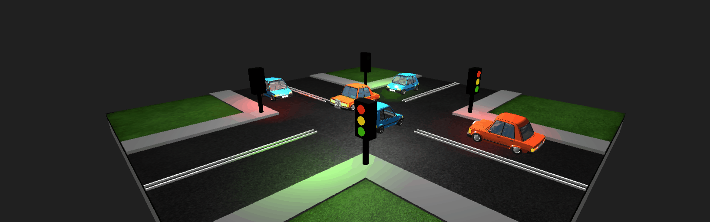

# INTELLIGENT TRAFFIC LIGHTS


_Animation above illustrates the simulation described in this project.
To view the full animation, you can run the frontend – go to this [section](##quick-start)_.

## Overview

This is a project that serves as a recruitment task.
It's a simulation of intelligent traffic lights at an intersection. The goal of the task was to design and implement a system that adjusts light cycles based on `traffic density`.

### Technologies

This is a full-stack application with a backend in Spring Boot and a frontend in plain JavaScript using the three.js library for creating 3D scenes.


### Description

The system simulates an intersection with four incoming roads (north, south, east, and west). The intersection is **conflict-based**, and the system assumes that a **conflict** occurs when one of the oncoming cars turns left while the other goes straight. In all other cases (e.g., both cars go straight or turn right), **no conflict occurs**, and both cars leave the intersection in the same step. In the case of a conflict, only one car (the one going straight) leaves the intersection.

The system tracks the number of vehicles waiting on each incoming road, and the duration of a traffic light change (which in the simulation corresponds to the number of steps) is determined by `proportions`. One full traffic light cycle (green for the north-south direction, followed by green for the east-west direction) is predefined as `10 steps` (this value can be easily modified depending on the situation). The number of steps assigned to a given green light phase depends on the ratio of cars in that direction compared to the other direction.

---

**Example**

- Number of cars on `NORTH` road: `6`
- Number of cars on `SOUTH` road: `4`
- Number of cars on `WEST` road: `2`
- Number of cars on `EAST` road: `3`

Given that the green light turns on simultaneously for the north-south roads and simultaneously for the east-west roads, the traffic light cycle would typically follow a pattern where each direction (north-south and east-west) gets green lights alternately:

- [ ] Total number of cars in the `north-south` direction `6 + 4 = 10`
- [ ] Total number of cars in the `east-west` direction `2 + 3 = 5`
- [ ] Total number of cars at the intersection `10 + 5 = 15`
- [ ] The ratio of cars in the `north-south` direction to the total number of cars `10 / 15 = 0.666`
- [ ] The ratio of cars in the `east-west` direction to the total number of cars `5 / 15 = 0.333`
- [ ] The number of steps (in real-life terms, time) for the `north-south` direction in the next traffic light cycle `0.666 ~ 7`
- [ ] The number of steps (in real-life terms, time) for the `east-west` direction in the next traffic light cycle `0.333 ~ 3`

---

**Simulation INPUT file example**

```json
{
  "commands": [
    {
      "type": "addVehicle",
      "vehicleId": "vehicle1",
      "startRoad": "south",
      "endRoad": "north"
    },
    {
      "type": "addVehicle",
      "vehicleId": "vehicle2",
      "startRoad": "north",
      "endRoad": "south"
    },
    {
      "type": "step"
    },
    {
      "type": "step"
    },
    {
      "type": "addVehicle",
      "vehicleId": "vehicle3",
      "startRoad": "west",
      "endRoad": "south"
    },
    {
      "type": "addVehicle",
      "vehicleId": "vehicle4",
      "startRoad": "west",
      "endRoad": "south"
    },
    {
      "type": "step"
    },
    {
      "type": "step"
    }
  ]
}
```

**Simulation OUTPUT file example**

```json
{
  "stepStatuses": [["vehicle1", "vehicle2"], [], ["vehicle3"], ["vehicle4"]]
}
```

- `stepStatuses` - contains a list of statuses for each step of the simulation.

- `leftVehicles` - contains a list of vehicle identifiers that have exited the intersection in the given step.

## Quick Start

#### 1. In order run only simulation from `command line` go to [backend directory](/backend) and execute this commands:

```
mvn clean package
```

`Note`: you must provide filepath to `input.json` file as well as `output.json` file. In the input file, you will find the necessary data to run the simulation. The output file does not need to exist at the time of running the command, but remember that you must provide paths to both files.

```
 java -jar target/backend-0.0.1-SNAPSHOT.jar input.json output.json
```

#### 2. Second way is to run backend as previous and obtain results from frontend

To do this go to [frontend directory](/frontend) and execute this commands:

**Developer mode**

```
npm i
```

```
npm run dev
```

**Production mode**

```
npm run build
```

```
npm run preview
```

## Credits

This project uses following graphic resources:

1. This work is based on "Low-poly cartoon style car 03" (https://sketchfab.com/3d-models/low-poly-cartoon-style-car-03-8c7f36b0a60745f487b300fa74d05990) by arturs.vitas (https://sketchfab.com/arturs.vitas) licensed under CC-BY-4.0 (http://creativecommons.org/licenses/by/4.0/).

2. This work is based on "Low-poly cartoon style car 01" (https://sketchfab.com/3d-models/low-poly-cartoon-style-car-01-69461da2e3a842c0868f5187c1282674) by arturs.vitas (https://sketchfab.com/arturs.vitas) licensed under CC-BY-4.0 (http://creativecommons.org/licenses/by/4.0/).

3. This work is based on "Idealny zielona trawa" (https://pl.freepik.com/darmowe-zdjecie/idealny-zielona-trawa_902965.htm#from_element=detail_alsolike) by freestockcenter.

4. This work is based on "Tektury tekstury" (https://pl.freepik.com/darmowe-zdjecie/tektury-tekstury_1035400.htm#fromView=keyword&page=1&position=5uuid=19cbd4f2-c25f-4ae6-b0e3-300c4f6dc4b0&query=Tekstura+Asfalt) bykues1.
